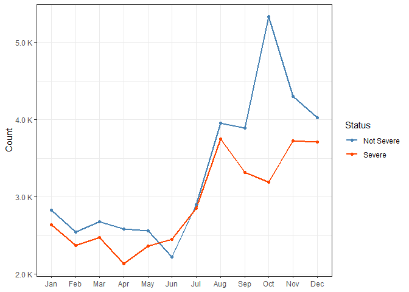
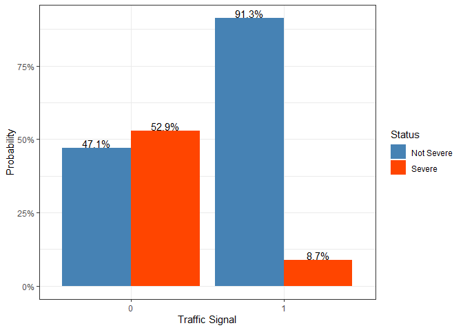
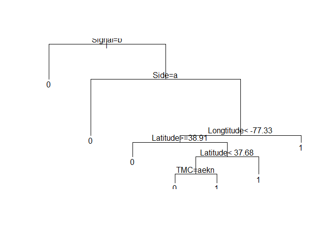

# Data Preprocessing
Read in data:


```r
options(warn = -1)
setwd("D:/UVA/Final/classification-of-car-accident-severity-level")
df <- read_csv("US_accident.csv", col_types = cols(.default = col_character())) %>% 
  type_convert() %>%
  mutate(TMC = factor(TMC), Severity = factor(Severity), Year = factor(Year), Weekday = factor(Weekday)) %>%
  mutate_if(is.logical, factor) %>%
  mutate_if(is.character, factor)
```

```
## Parsed with column specification:
## cols(
##   .default = col_double(),
##   TMC = col_character(),
##   Start_Time = col_datetime(format = ""),
##   End_Time = col_datetime(format = ""),
##   Street = col_character(),
##   Side = col_character(),
##   City = col_character(),
##   County = col_character(),
##   State = col_character(),
##   Zipcode = col_character(),
##   Country = col_character(),
##   Weather_Condition = col_character(),
##   Sunrise_Sunset = col_character(),
##   Civil_Twilight = col_character(),
##   Nautical_Twilight = col_character(),
##   Astronomical_Twilight = col_character(),
##   Month = col_character(),
##   Weekday = col_character()
## )
```

```
## See spec(...) for full column specifications.
```


Plot the locations of car accidents. I used leaflet for visulization but this output file seems too big to post here so I commented the code below:

```r
# leaflet(df) %>% 
#   addTiles() %>%
#   setView(lng = -78.5080, lat = 38.0336, zoom = 7)%>% 
#   addCircles(lng = df[df$Severity %in% c("1", "2"),]$Start_Lng, lat = df[df$Severity %in% c("1", "2"),]$Start_Lat, weight = 1.2, col="blue")%>%
#   addCircles(lng = df[df$Severity %in% c("3", "4"),]$Start_Lng, lat = df[df$Severity %in% c("3", "4"),]$Start_Lat, weight = 1.2, col="orangered")%>%
#   addLegend("topleft", title = "Accident Severity", colors = c("orangered", "blue"), labels = c("Severe", "Not Severe"))
```


Accident duration is very skewed, so logarithms are taken


```r
df$Junction <- as.factor(df$Junction)
df$Traffic_Signal <- as.factor(df$Traffic_Signal)
df$Month <- factor(df$Month, levels = c("Jan", "Feb", "Mar", "Apr", "May",
                                        "Jun", "Jul", "Aug", "Sep", "Oct",
                                        "Nov", "Dec"))
##Check distribution of duration
hist(df$Duration)
```

<!-- -->

```r
##Take Logarithms of Duration
df$Duration <- log(df$Duration)
##filter out Weather Condition NA.
df <- df %>% filter(!(is.na(Weather_Condition)))
```
There are too many weather conditions recorded. Weather conditions with fewer than 20 occurances are deleted and similar weather conditions are merged.

```r
##Drop uncommon weather condition 
df %>% count(Weather_Condition) %>% filter(n < 20) %>% select(Weather_Condition, n)
```

```
## # A tibble: 18 x 2
##    Weather_Condition          n
##    <fct>                  <int>
##  1 Blowing Snow               5
##  2 Drizzle / Windy            1
##  3 Drizzle and Fog            2
##  4 Heavy Drizzle             19
##  5 Heavy Rain / Windy         1
##  6 Heavy Snow                16
##  7 Heavy T-Storm / Windy      6
##  8 Ice Pellets                5
##  9 Light Fog                  1
## 10 Light Freezing Drizzle     9
## 11 Light Ice Pellets         11
## 12 N/A Precipitation          3
## 13 Rain / Windy               5
## 14 Squalls                    3
## 15 T-Storm / Windy            4
## 16 Thunder / Windy            2
## 17 Wintry Mix                16
## 18 Wintry Mix / Windy         3
```

```r
drop_weather <- df %>% count(Weather_Condition) %>% filter(n < 20) %>% select(Weather_Condition)
drop_weather <- drop_weather$Weather_Condition %>% unlist()
df <- df %>% 
  filter(!(Weather_Condition %in% drop_weather)) %>% 
  mutate(Weather_Condition = factor(Weather_Condition))

###Merge some weather conditions
df$Weather_Condition <- as.character(df$Weather_Condition)
df$Weather_Condition[df$Weather_Condition %in% c("Cloudy", "Cloudy / Windy", "Mostly Cloudy", "Mostly Cloudy / Windy", "Partly Cloudy", "Partly Cloudy / Windy", "Scattered Clouds")]<-c("Cloudy/Windy")
df$Weather_Condition[df$Weather_Condition %in% c("Thunder", "Thunderstorm", "Thunderstorms and Rain", "Thunder in the Vicinity")]<- c("Thunder")
df$Weather_Condition[df$Weather_Condition %in% c("Haze", "Fog", "Patches of Fog", "Mist", "Shallow Fog", "Light Freezing Fog")]<- c("Haze/Mist/Fog")
df$Weather_Condition[df$Weather_Condition %in% c("Clear", "Fair", "Fair / Windy")]<-c("Clear/Fair")
df$Weather_Condition[df$Weather_Condition %in% c("Light Freezing Rain", "Light Thunderstorms and Rain","Light Rain", "Light Rain / Windy", "Light Drizzle", "Light Rain with Thunder", "Drizzle")]<- c("Rain")                
df$Weather_Condition[df$Weather_Condition %in% c("Heavy T-Storm", "Heavy Thunderstorms and Rain")]<- c("T-Storm")
df$Weather_Condition <- as.factor(df$Weather_Condition)
table(df$Weather_Condition)
```

```
## 
##    Clear/Fair  Cloudy/Windy Haze/Mist/Fog    Heavy Rain    Light Snow 
##         27438         26752           868           533           561 
##      Overcast          Rain          Snow       T-Storm       Thunder 
##         11749          6386           103           150           279
```

Monday to Friday share very similar patterns so 'Weekday' is changed to dummy variables where weekdays to 1, weekends to 0.

```r
df$Weekday <- as.character(df$Weekday)
df$Weekday[df$Weekday %in% c("Mon", "Tue", "Wed", "Thu", "Fri")]<- c("1")
df$Weekday[df$Weekday %in% c("Sat", "Sun")]<- c("0")
df$Weekday <- as.factor(df$Weekday)
```

Drop uncommon TMC factor.

```r
df%>% count(TMC) %>% filter(n < 10)
```

```
## # A tibble: 5 x 2
##   TMC       n
##   <fct> <int>
## 1 200       3
## 2 206       5
## 3 248       6
## 4 339       5
## 5 341       1
```

```r
drop_TMC <- df%>% count(TMC) %>% filter(n < 10) %>% select(TMC)
drop_TMC <- drop_TMC$TMC %>% unlist()
df <- df %>% filter(!TMC %in% drop_TMC) %>% mutate(TMC = factor(TMC))
```

Merge severity 3 and 4 to be "Severe", and 1 2 to be "Not Severe"

```r
df_label <- df %>%
  mutate("Status" = ifelse(Severity == "3" | Severity == "4", "Severe", "Not Severe"))
```

Remove Near Zero Variance Predictors.

```r
nzv <- nearZeroVar(df_label, saveMetrics = T)
nzv[nzv$nzv,]
```

```
##                  freqRatio percentUnique zeroVar  nzv
## State              0.00000   0.001336916    TRUE TRUE
## Country            0.00000   0.001336916    TRUE TRUE
## Visibility        30.34172   0.041444404   FALSE TRUE
## Amenity           93.92259   0.002673833   FALSE TRUE
## Bump               0.00000   0.001336916    TRUE TRUE
## Crossing          19.21048   0.002673833   FALSE TRUE
## Give_Way         175.82979   0.002673833   FALSE TRUE
## No_Exit         2670.39286   0.002673833   FALSE TRUE
## Railway          419.21910   0.002673833   FALSE TRUE
## Roundabout      6798.90909   0.002673833   FALSE TRUE
## Station          103.61399   0.002673833   FALSE TRUE
## Stop             142.29310   0.002673833   FALSE TRUE
## Traffic_Calming 2875.88462   0.002673833   FALSE TRUE
## Turning_Loop       0.00000   0.001336916    TRUE TRUE
```

```r
nzv_cols <- rownames(nzv[nzv$nzv,])
df_label <- subset(df_label, select = -c(State,Country,Visibility,Amenity,Bump,Crossing,Give_Way,No_Exit,Railway,Roundabout,Station,Stop,Traffic_Calming,Turning_Loop))
```

Remove Street, start time, end time, zip code.

```r
df_location <- subset(df_label, select = -c(Street, Start_Time, End_Time, Zipcode, City, Severity, County, Sunrise_Sunset, Astronomical_Twilight, Nautical_Twilight))
df<- df_location
```

Rename some variables.

```r
df <-  df %>%
  rename("Latitude" = `Start_Lat`, "Longtitude" = `Start_Lng`, "Signal" = `Traffic_Signal`, 
         "Weather" = `Weather_Condition`)
```

# Visualizations


Get density of accident severity by hour of day:

```r
df %>%
  ggplot(aes(x= Hour, fill = Status))+
  geom_density( color="#e9ecef", alpha=0.6, position = 'identity') +
  scale_fill_manual(values=c("steelblue", "orangered")) +
  theme_bw() +
  labs(fill="")
```

<!-- -->


Get relationship between counts of accident and month:

```r
ggplot(data = df, aes(x= Month,  group = Status))+
  geom_line(stat = 'count',aes(color= Status), size = 0.8)+
  geom_point(stat = 'count', aes(color= Status)) +
  scale_color_manual(values=c("steelblue", "orangered")) +
  labs(y = "Count",
       x = NULL) +
  scale_y_continuous(labels = unit_format(unit = "K", scale = 1e-03))+
  theme_bw()
```

<!-- -->

Get relationship between severity probability and traffic signal:

```r
df %>%
  group_by(Signal, Status) %>%
  count()%>%
  group_by(Signal)%>%
  mutate(sum = sum(n))%>%
  mutate(Proportion = n/sum)%>%
  ggplot(aes(Signal, Proportion, group = Status))+
  geom_col(aes(fill = Status), position = "dodge")+
  scale_fill_manual(values=c("steelblue", "orangered")) +
  theme_bw()+
  geom_text(aes(label = scales::percent(Proportion)), position = position_dodge(0.9), vjust=-0.1) + 
  scale_y_continuous(labels = percent)+
  labs(x = "Traffic Signal",
       y = "Probability")
```

<!-- -->

Get relationship between accident severity density and side of road:

```r
df %>%
  ggplot(aes(x= Side, fill = Status))+
  geom_bar( color="#e9ecef", alpha=0.4, position = 'identity') +
  scale_fill_manual(values=c("steelblue", "orangered")) +
  theme_bw() +
  labs(fill="")+
  ggtitle("Density of Accident Severity by Road Side")
```

<!-- -->

# Modeling
Let me sample fewer observations so that the code runs faster.

```r
df <- df[sample(1:nrow(df), 5000, replace = F),]
```
Partition data to train, validation, test:

```r
set.seed(1)
df_parts <- resample_partition(df, c(train = 0.8, test = 0.2))
train <- as_tibble(df_parts$train)
test <- as_tibble(df_parts$test)
```
## Logistic Regression

```r
train$Status[train$Status=="Severe"]<- 1
train$Status[train$Status=="Not Severe"]<- 0
train$Status <- as.numeric(train$Status)
test$Status[test$Status=="Severe"]<- 1
test$Status[test$Status=="Not Severe"]<- 0
test$Status <- as.numeric(test$Status)

logit <- glm(Status ~., data = train, family = binomial)
logit_aic <- step(logit, trace = 0)
round(summary(logit_aic)$coef, dig=3)
```

```
##                     Estimate Std. Error z value Pr(>|z|)
## (Intercept)           16.255      5.727   2.838    0.005
## TMC202               -14.277    225.313  -0.063    0.949
## TMC203                 1.587      0.329   4.818    0.000
## TMC222                 0.718      0.974   0.737    0.461
## TMC229                -1.033      1.007  -1.025    0.305
## TMC236                 1.622      1.447   1.121    0.262
## TMC241                 0.713      0.134   5.312    0.000
## TMC244                 1.246      1.124   1.108    0.268
## TMC245                 1.506      0.300   5.016    0.000
## TMC246                 3.084      1.149   2.684    0.007
## TMC247               -13.345    408.053  -0.033    0.974
## TMC406                 1.068      0.615   1.738    0.082
## TMCNA_TMC             -0.185      0.111  -1.675    0.094
## Latitude               0.166      0.050   3.310    0.001
## Longtitude             0.186      0.039   4.729    0.000
## Distance               0.270      0.040   6.822    0.000
## SideR                  1.667      0.124  13.392    0.000
## Pressure              -0.260      0.110  -2.372    0.018
## Wind_Speed             0.030      0.010   3.175    0.001
## Junction1              0.331      0.136   2.435    0.015
## Signal1               -2.444      0.166 -14.698    0.000
## Civil_TwilightNight    0.636      0.097   6.571    0.000
## Year2017               0.022      0.157   0.140    0.889
## Year2018              -0.054      0.159  -0.337    0.736
## Year2019              -0.635      0.169  -3.761    0.000
## MonthFeb              -0.013      0.201  -0.063    0.950
## MonthMar               0.245      0.198   1.235    0.217
## MonthApr               0.197      0.207   0.949    0.343
## MonthMay               0.341      0.204   1.672    0.095
## MonthJun               0.287      0.207   1.385    0.166
## MonthJul               0.344      0.192   1.787    0.074
## MonthAug               0.048      0.185   0.261    0.794
## MonthSep               0.104      0.190   0.547    0.585
## MonthOct              -0.355      0.178  -2.000    0.045
## MonthNov              -0.165      0.181  -0.910    0.363
## MonthDec              -0.267      0.185  -1.449    0.147
## Hour                   0.041      0.008   5.434    0.000
## Weekday1              -1.904      0.175 -10.854    0.000
## Duration              -0.183      0.053  -3.481    0.000
```

```r
logit_aic$anova[2:nrow(logit_aic$anova), c(1, 6)] %>% as_tibble() %>% mutate(Step = str_sub(Step, start = 3)) %>%
  rename("Vaiables to drop" = Step)
```

```
## # A tibble: 4 x 2
##   `Vaiables to drop`   AIC
##   <chr>              <dbl>
## 1 Weather            4345.
## 2 Temperature        4343.
## 3 Day                4341.
## 4 Humidity           4340.
```

```r
logit_aic$call
```

```
## glm(formula = Status ~ TMC + Latitude + Longtitude + Distance + 
##     Side + Pressure + Wind_Speed + Junction + Signal + Civil_Twilight + 
##     Year + Month + Hour + Weekday + Duration, family = binomial, 
##     data = train)
```

```r
# prediction 
logit_pred = (predict(logit_aic, test[, 1:19])>0)
pred_table =table(logit_pred, test$Status)
rownames(pred_table)<- c("0", "1")
cm <-caret::confusionMatrix(pred_table)
tibble("Accuracy" = cm$overall[[1]], "Sensitivity" = cm$byClass[[1]],
       "Specificity" = cm$byClass[[2]], "Positive term" = cm$positive)
```

```
## # A tibble: 1 x 4
##   Accuracy Sensitivity Specificity `Positive term`
##      <dbl>       <dbl>       <dbl> <chr>          
## 1    0.710       0.673       0.751 0
```

## Sparse Logistic Regression (Logistic with lasso penalty)

```r
library(glmnet)
x<- model.matrix(Status~., data = train)
test.x <- model.matrix(Status~., data = test)

model_total <- glmnet(x, train$Status, family = "binomial")
plot(model_total)
```

<!-- -->

```r
model_lambda <- cv.glmnet(x, train$Status, family = "binomial")
plot(model_lambda)
```

<!-- -->

```r
model_total <- glmnet(x, train$Status, family = "binomial", lambda = model_lambda$lambda.min)
coef <- predict(model_total, type="coefficients")
sp.pred <- (predict(model_total, test.x)>0)
pred_table =table(sp.pred, test$Status)
rownames(pred_table)<- c("0", "1")
cm <-caret::confusionMatrix(pred_table)
tibble("Accuracy" = cm$overall[[1]], "Sensitivity" = cm$byClass[[1]],
       "Specificity" = cm$byClass[[2]], "Positive term" = cm$positive)
```

```
## # A tibble: 1 x 4
##   Accuracy Sensitivity Specificity `Positive term`
##      <dbl>       <dbl>       <dbl> <chr>          
## 1    0.707       0.673       0.745 0
```


## Try boosting the logistic model

```r
library(gbm)
```

```
## Loaded gbm 2.1.8
```

```r
gb <- gbm(formula = Status ~., distribution = "bernoulli", data = train, interaction.depth = 4, n.trees = 4500, shrinkage = 0.1, cv.folds = 3)
ntree_opt<- gbm.perf(gb, method = "cv")
```

<!-- -->

```r
print(gb)
```

```
## gbm(formula = Status ~ ., distribution = "bernoulli", data = train, 
##     n.trees = 4500, interaction.depth = 4, shrinkage = 0.1, cv.folds = 3)
## A gradient boosted model with bernoulli loss function.
## 4500 iterations were performed.
## The best cross-validation iteration was 151.
## There were 19 predictors of which 19 had non-zero influence.
```

```r
gb_graph <- summary(gb)
```

<!-- -->

```r
gb_graph %>% ggplot(aes(x=rel.inf, y = reorder(var, rel.inf)))+
  geom_col(fill = "steelblue")+
  theme_bw()+
  labs(x = "Relative Influence", y = "Variables")
```

<!-- -->

```r
pred <- predict(object = gb, newdata = test, n.trees = 4800, type = "response")
gb.pred <- as.factor(ifelse(pred>0.5, 1, 0))
pred_table =table(gb.pred, test$Status)
cm <-caret::confusionMatrix(pred_table)
tibble("Accuracy" = cm$overall[[1]], "Sensitivity" = cm$byClass[[1]],
       "Specificity" = cm$byClass[[2]], "Positive term" = cm$positive)
```

```
## # A tibble: 1 x 4
##   Accuracy Sensitivity Specificity `Positive term`
##      <dbl>       <dbl>       <dbl> <chr>          
## 1    0.783       0.769       0.799 0
```


## Decision Tree Model

```r
model_decision <- rpart(Status ~ ., data = train, method = "class", minsplit = 10, cp = 0.022)
rpart.plot(model_decision, box.palette = "RdBu", shadow.col = "grey", tweak = 1.5)
```

<!-- -->

```r
plot(model_decision)
text(model_decision)
```

<!-- -->

```r
plotcp(model_decision)
```

<!-- -->

```r
model_decision$cptable 
```

```
##           CP nsplit rel error    xerror       xstd
## 1 0.14266738      0 1.0000000 1.0000000 0.01677162
## 2 0.03577754      2 0.7146652 0.7497343 0.01605648
## 3 0.02763018      5 0.6073326 0.7104145 0.01585165
## 4 0.02200000      6 0.5797024 0.6679065 0.01559933
```

```r
prune(model_decision, cp = 0.041)
```

```
## n= 3999 
## 
## node), split, n, loss, yval, (yprob)
##       * denotes terminal node
## 
## 1) root 3999 1882 0 (0.52938235 0.47061765)  
##   2) Signal=1 540   50 0 (0.90740741 0.09259259) *
##   3) Signal=0 3459 1627 1 (0.47036716 0.52963284)  
##     6) Side=L 518   93 0 (0.82046332 0.17953668) *
##     7) Side=R 2941 1202 1 (0.40870452 0.59129548) *
```

```r
pred = predict(model_decision, test, type = "class")
pred_table =table(pred, test$Status)
cm <-caret::confusionMatrix(pred_table)
tibble("Accuracy" = cm$overall[[1]], "Sensitivity" = cm$byClass[[1]],
       "Specificity" = cm$byClass[[2]], "Positive term" = cm$positive)
```

```
## # A tibble: 1 x 4
##   Accuracy Sensitivity Specificity `Positive term`
##      <dbl>       <dbl>       <dbl> <chr>          
## 1    0.722       0.706       0.741 0
```

## Random Forest Model

```r
library(randomForest)
library(e1071)

model_rf <- tune.randomForest(x= train[ ,1:19], y= as.factor(train$Status), nodesize = seq(1,10,1), mtry = 7, ntree = 500, number = 5)
print(model_rf)
```

```
## 
## Parameter tuning of 'randomForest':
## 
## - sampling method: 10-fold cross validation 
## 
## - best parameters:
##  nodesize mtry ntree
##        10    7   500
## 
## - best performance: 0.1985526
```

```r
rf = randomForest(y=as.factor(train$Status), x= train[,1:19], mtry = 7, ntree = 500, nodesize = 1,random_state = 0)
rf.pred <- predict(rf, newdata = test[, 1:19])
pred_table =table(rf.pred, test$Status)
cm <-caret::confusionMatrix(pred_table)
tibble("Accuracy" = cm$overall[[1]], "Sensitivity" = cm$byClass[[1]],
       "Specificity" = cm$byClass[[2]], "Positive term" = cm$positive)
```

```
## # A tibble: 1 x 4
##   Accuracy Sensitivity Specificity `Positive term`
##      <dbl>       <dbl>       <dbl> <chr>          
## 1    0.802       0.759       0.849 0
```

```r
plot(rf, main = NULL)
```

<!-- -->

```r
rf.err <- rf$err.rate
ntrees <- seq(1:500)
rf.err <- as.data.frame(cbind(ntrees, rf.err))

rf.err <-  rf.err %>%
  rename("Not_Severe" = `0`, "Severe" = `1`)


rf.err %>% ggplot(aes(x=ntrees))+
  geom_line(aes(y = OOB), color = 'black', size = 1)+
  geom_line(aes(y=Not_Severe), color = 'steelblue',  size = 1)+
  geom_line(aes(y=Severe), color = 'orangered', size = 1)+
  theme_bw()+
  labs(x = "Number of Trees", y = "OOB Error", color = "Legend")+
  scale_color_manual(labels = c("OOB", "Severe", "Not_Severe"))
```

<!-- -->

```r
##MeanDecreaseGini value
rf.fit = randomForest(y=as.factor(train$Status), x= train[,1:19], mtry = 7, ntree = 500, nodesize = 1, importance = TRUE)
barplot(importance(rf.fit)[,4], ylab = "MeanDecreaseGini value", xlab = "Covariates", main = "Barplot of MeanDecreaseGini value")
```

<!-- -->

```r
importance <- as.data.frame(importance(rf.fit))
graph1 <- as.data.frame(cbind(Covariates=rownames(importance), MeanDecreaseGini =importance$MeanDecreaseGini))
graph1$MeanDecreaseGini <- as.numeric(as.character(graph1$MeanDecreaseGini))


graph1 %>%
  ggplot(aes( y = MeanDecreaseGini, x= reorder(Covariates, MeanDecreaseGini))) +
  geom_col(fill = "steelblue")+
  theme_bw()+
  labs(y = "Mean Decrease Gini", x = "Variables")+
  coord_flip()
```

<!-- -->


## Linear and Non-linear SVM

```r
 library(e1071)
#Fit Linear SVM
lsvm <- svm(Status ~. , data = train,type='C-classification', kernel='linear',scale=FALSE, cost =0.1)
lsvm.pred <- predict(lsvm, test[, 1:19], decision.values = TRUE)
pred_table =table(lsvm.pred, test$Status)
cm <-caret::confusionMatrix(pred_table)
tibble("Accuracy" = cm$overall[[1]], "Sensitivity" = cm$byClass[[1]],
        "Specificity" = cm$byClass[[2]], "Positive term" = cm$positive)
```

```
## # A tibble: 1 x 4
##   Accuracy Sensitivity Specificity `Positive term`
##      <dbl>       <dbl>       <dbl> <chr>          
## 1    0.719       0.694       0.747 0
```

```r
# Fit Non-Linear SVM
nsvm <- svm(Status ~. , data = train,type='C-classification', kernel='radial',scale=FALSE, cost =1)
nsvm.pred <- predict(nsvm, test[, 1:19], decision.values = TRUE)
pred_table =table(nsvm.pred, test$Status)
cm <-caret::confusionMatrix(pred_table)
tibble("Accuracy" = cm$overall[[1]], "Sensitivity" = cm$byClass[[1]],
        "Specificity" = cm$byClass[[2]], "Positive term" = cm$positive)
```

```
## # A tibble: 1 x 4
##   Accuracy Sensitivity Specificity `Positive term`
##      <dbl>       <dbl>       <dbl> <chr>          
## 1    0.605       0.679       0.525 0
```
