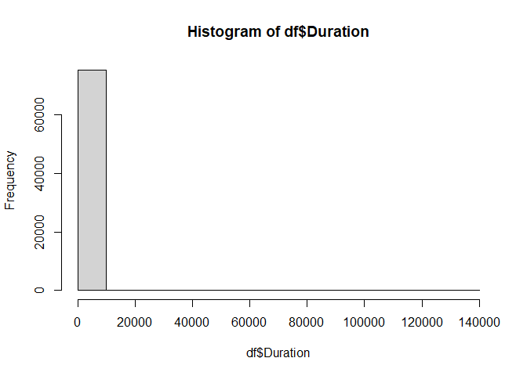
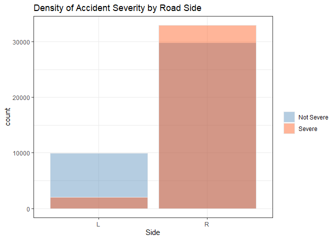

## Data Preprocessing
Read in data:


```r
options(warn = -1)
setwd("D:/UVA/Final/classification-of-car-accident-severity-level")
df <- read_csv("US_accident.csv", col_types = cols(.default = col_character())) %>% 
  type_convert() %>%
  mutate(TMC = factor(TMC), Severity = factor(Severity), Year = factor(Year), Weekday = factor(Weekday)) %>%
  mutate_if(is.logical, factor) %>%
  mutate_if(is.character, factor)
```

```
## Parsed with column specification:
## cols(
##   .default = col_double(),
##   TMC = col_character(),
##   Start_Time = col_datetime(format = ""),
##   End_Time = col_datetime(format = ""),
##   Street = col_character(),
##   Side = col_character(),
##   City = col_character(),
##   County = col_character(),
##   State = col_character(),
##   Zipcode = col_character(),
##   Country = col_character(),
##   Weather_Condition = col_character(),
##   Sunrise_Sunset = col_character(),
##   Civil_Twilight = col_character(),
##   Nautical_Twilight = col_character(),
##   Astronomical_Twilight = col_character(),
##   Month = col_character(),
##   Weekday = col_character()
## )
```

```
## See spec(...) for full column specifications.
```
Plot the locations of car accidents. I used leaflet for visulization but this output file seems too big to post here so I commented the code below:

```r
# leaflet(df) %>% 
#   addTiles() %>%
#   setView(lng = -78.5080, lat = 38.0336, zoom = 7)%>% 
#   addCircles(lng = df[df$Severity %in% c("1", "2"),]$Start_Lng, lat = df[df$Severity %in% c("1", "2"),]$Start_Lat, weight = 1.2, col="blue")%>%
#   addCircles(lng = df[df$Severity %in% c("3", "4"),]$Start_Lng, lat = df[df$Severity %in% c("3", "4"),]$Start_Lat, weight = 1.2, col="orangered")%>%
#   addLegend("topleft", title = "Accident Severity", colors = c("orangered", "blue"), labels = c("Severe", "Not Severe"))
```


Accident duration is very skewed, so logarithms are taken


```r
df$Junction <- as.factor(df$Junction)
df$Traffic_Signal <- as.factor(df$Traffic_Signal)
df$Month <- factor(df$Month, levels = c("Jan", "Feb", "Mar", "Apr", "May",
                                        "Jun", "Jul", "Aug", "Sep", "Oct",
                                        "Nov", "Dec"))
##Check distribution of duration
hist(df$Duration)
```

<!-- -->

```r
##Take Logarithms of Duration
df$Duration <- log(df$Duration)
##filter out Weather Condition NA.
df <- df %>% filter(!(is.na(Weather_Condition)))
```
There are too many weather conditions recorded. Weather conditions with fewer than 20 occurances are deleted and similar weather conditions are merged.

```r
##Drop uncommon weather condition 
df %>% count(Weather_Condition) %>% filter(n < 20) %>% select(Weather_Condition, n)
```

```
## # A tibble: 18 x 2
##    Weather_Condition          n
##    <fct>                  <int>
##  1 Blowing Snow               5
##  2 Drizzle / Windy            1
##  3 Drizzle and Fog            2
##  4 Heavy Drizzle             19
##  5 Heavy Rain / Windy         1
##  6 Heavy Snow                16
##  7 Heavy T-Storm / Windy      6
##  8 Ice Pellets                5
##  9 Light Fog                  1
## 10 Light Freezing Drizzle     9
## 11 Light Ice Pellets         11
## 12 N/A Precipitation          3
## 13 Rain / Windy               5
## 14 Squalls                    3
## 15 T-Storm / Windy            4
## 16 Thunder / Windy            2
## 17 Wintry Mix                16
## 18 Wintry Mix / Windy         3
```

```r
drop_weather <- df %>% count(Weather_Condition) %>% filter(n < 20) %>% select(Weather_Condition)
drop_weather <- drop_weather$Weather_Condition %>% unlist()
df <- df %>% 
  filter(!(Weather_Condition %in% drop_weather)) %>% 
  mutate(Weather_Condition = factor(Weather_Condition))

###Merge some weather conditions
df$Weather_Condition <- as.character(df$Weather_Condition)
df$Weather_Condition[df$Weather_Condition %in% c("Cloudy", "Cloudy / Windy", "Mostly Cloudy", "Mostly Cloudy / Windy", "Partly Cloudy", "Partly Cloudy / Windy", "Scattered Clouds")]<-c("Cloudy/Windy")
df$Weather_Condition[df$Weather_Condition %in% c("Thunder", "Thunderstorm", "Thunderstorms and Rain", "Thunder in the Vicinity")]<- c("Thunder")
df$Weather_Condition[df$Weather_Condition %in% c("Haze", "Fog", "Patches of Fog", "Mist", "Shallow Fog", "Light Freezing Fog")]<- c("Haze/Mist/Fog")
df$Weather_Condition[df$Weather_Condition %in% c("Clear", "Fair", "Fair / Windy")]<-c("Clear/Fair")
df$Weather_Condition[df$Weather_Condition %in% c("Light Freezing Rain", "Light Thunderstorms and Rain","Light Rain", "Light Rain / Windy", "Light Drizzle", "Light Rain with Thunder", "Drizzle")]<- c("Rain")                
df$Weather_Condition[df$Weather_Condition %in% c("Heavy T-Storm", "Heavy Thunderstorms and Rain")]<- c("T-Storm")
df$Weather_Condition <- as.factor(df$Weather_Condition)
table(df$Weather_Condition)
```

```
## 
##    Clear/Fair  Cloudy/Windy Haze/Mist/Fog    Heavy Rain    Light Snow 
##         27438         26752           868           533           561 
##      Overcast          Rain          Snow       T-Storm       Thunder 
##         11749          6386           103           150           279
```

Monday to Friday share very similar patterns so 'Weekday' is changed to dummy variables where weekdays to 1, weekends to 0.

```r
df$Weekday <- as.character(df$Weekday)
df$Weekday[df$Weekday %in% c("Mon", "Tue", "Wed", "Thu", "Fri")]<- c("1")
df$Weekday[df$Weekday %in% c("Sat", "Sun")]<- c("0")
df$Weekday <- as.factor(df$Weekday)
```

Drop uncommon TMC factor.

```r
df%>% count(TMC) %>% filter(n < 10)
```

```
## # A tibble: 5 x 2
##   TMC       n
##   <fct> <int>
## 1 200       3
## 2 206       5
## 3 248       6
## 4 339       5
## 5 341       1
```

```r
drop_TMC <- df%>% count(TMC) %>% filter(n < 10) %>% select(TMC)
drop_TMC <- drop_TMC$TMC %>% unlist()
df <- df %>% filter(!TMC %in% drop_TMC) %>% mutate(TMC = factor(TMC))
```

Merge severity 3 and 4 to be "Severe", and 1 2 to be "Not Severe"

```r
df_label <- df %>%
  mutate("Status" = ifelse(Severity == "3" | Severity == "4", "Severe", "Not Severe"))
```

Remove Near Zero Variance Predictors.

```r
nzv <- nearZeroVar(df_label, saveMetrics = T)
nzv[nzv$nzv,]
```

```
##                  freqRatio percentUnique zeroVar  nzv
## State              0.00000   0.001336916    TRUE TRUE
## Country            0.00000   0.001336916    TRUE TRUE
## Visibility        30.34172   0.041444404   FALSE TRUE
## Amenity           93.92259   0.002673833   FALSE TRUE
## Bump               0.00000   0.001336916    TRUE TRUE
## Crossing          19.21048   0.002673833   FALSE TRUE
## Give_Way         175.82979   0.002673833   FALSE TRUE
## No_Exit         2670.39286   0.002673833   FALSE TRUE
## Railway          419.21910   0.002673833   FALSE TRUE
## Roundabout      6798.90909   0.002673833   FALSE TRUE
## Station          103.61399   0.002673833   FALSE TRUE
## Stop             142.29310   0.002673833   FALSE TRUE
## Traffic_Calming 2875.88462   0.002673833   FALSE TRUE
## Turning_Loop       0.00000   0.001336916    TRUE TRUE
```

```r
nzv_cols <- rownames(nzv[nzv$nzv,])
df_label <- subset(df_label, select = -c(State,Country,Visibility,Amenity,Bump,Crossing,Give_Way,No_Exit,Railway,Roundabout,Station,Stop,Traffic_Calming,Turning_Loop))
```

Remove Street, start time, end time, zip code.

```r
df_location <- subset(df_label, select = -c(Street, Start_Time, End_Time, Zipcode, City, Severity, County, Sunrise_Sunset, Astronomical_Twilight, Nautical_Twilight))
df<- df_location
```

Rename some variables.

```r
df <-  df %>%
  rename("Latitude" = `Start_Lat`, "Longtitude" = `Start_Lng`, "Signal" = `Traffic_Signal`, 
         "Weather" = `Weather_Condition`)
```

## Visualizations

Partition data to train, validation, test:

```r
set.seed(1)
df_parts <- resample_partition(df, c(train = 0.8, test = 0.2))
train <- as_tibble(df_parts$train)
test <- as_tibble(df_parts$test)
```

Get density of accident severity by hour of day:

```r
df %>%
  ggplot(aes(x= Hour, fill = Status))+
  geom_density( color="#e9ecef", alpha=0.6, position = 'identity') +
  scale_fill_manual(values=c("steelblue", "orangered")) +
  theme_bw() +
  labs(fill="")
```

<!-- -->


Get relationship between counts of accident and month:

```r
ggplot(data = df, aes(x= Month,  group = Status))+
  geom_line(stat = 'count',aes(color= Status), size = 0.8)+
  geom_point(stat = 'count', aes(color= Status)) +
  scale_color_manual(values=c("steelblue", "orangered")) +
  labs(y = "Count",
       x = NULL) +
  scale_y_continuous(labels = unit_format(unit = "K", scale = 1e-03))+
  theme_bw()
```

<!-- -->

Get relationship between severity probability and traffic signal:

```r
df %>%
  group_by(Signal, Status) %>%
  count()%>%
  group_by(Signal)%>%
  mutate(sum = sum(n))%>%
  mutate(Proportion = n/sum)%>%
  ggplot(aes(Signal, Proportion, group = Status))+
  geom_col(aes(fill = Status), position = "dodge")+
  scale_fill_manual(values=c("steelblue", "orangered")) +
  theme_bw()+
  geom_text(aes(label = scales::percent(Proportion)), position = position_dodge(0.9), vjust=-0.1) + 
  scale_y_continuous(labels = percent)+
  labs(x = "Traffic Signal",
       y = "Probability")
```

<!-- -->

Get relationship between accident severity density and side of road:

```r
df %>%
  ggplot(aes(x= Side, fill = Status))+
  geom_bar( color="#e9ecef", alpha=0.4, position = 'identity') +
  scale_fill_manual(values=c("steelblue", "orangered")) +
  theme_bw() +
  labs(fill="")+
  ggtitle("Density of Accident Severity by Road Side")
```

<!-- -->

## Modeling
# Logistic Regression


